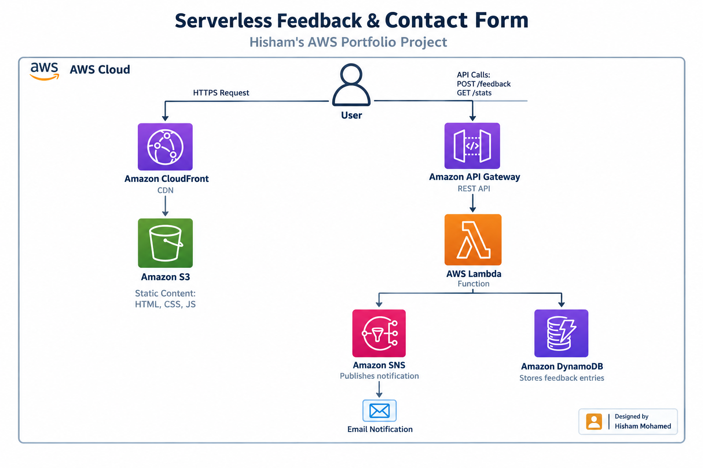

# 📬 Serverless Feedback & Contact Form

> A contact form with no server behind it. Every click routes straight through a live AWS pipeline — no PHP mailer, no Node backend, no container to babysit.

**🔗 Live demo:** https://dg6yygcvdtl2c.cloudfront.net


---

## What happens when you hit "Send"
 

 
No form-backend SaaS. No PHP mailer script. Just six AWS services doing exactly one job each.

## The stack, and why each piece is there

| # | Service | Job |
|---|---|---|
| 1 | **CloudFront** | HTTPS + CDN in front of a bucket that has zero public access |
| 2 | **S3** | Holds the static site — private, reachable only via CloudFront's Origin Access Control |
| 3 | **API Gateway (HTTP API)** | The only door in — routes `POST /feedback` and `GET /stats` to one Lambda |
| 4 | **Lambda** | The brain — validates input, writes to Dynamo, fires off a notification |
| 5 | **DynamoDB** | Where every message actually lives (partition key: `id`) |
| 6 | **SNS** | Taps me on the shoulder by email the moment someone writes in |

## Repo layout

```
serverless-feedback-form/
├── frontend/            → deployed straight to S3
│   ├── index.html
│   ├── style.css
│   └── script.js
└── backend/
    └── lambda_function.py
```

## Wiring it up yourself

1. Create a DynamoDB table with partition key `id` (String).
2. Create an SNS topic + email subscription (and confirm it — check your inbox).
3. Deploy `backend/lambda_function.py` to Lambda (Python 3.13), with env vars:
   - `TABLE_NAME` → your table name
   - `TOPIC_ARN` → your topic ARN
4. Build an HTTP API in API Gateway with `POST /feedback` and `GET /stats`, both pointed at that Lambda.
5. **Don't skip CORS** — configure *and deploy* it on the API, or every request dies at the browser's preflight check before it even reaches Lambda. (Ask me how I know.)
6. Point `frontend/script.js`'s `API_URL` at your API's invoke URL, then upload `frontend/` to a private S3 bucket fronted by CloudFront.

## Lessons this project actually taught me

- A stale CloudFront cache will make you debug the *wrong layer* for twenty minutes — always check for an invalidation before assuming the backend is broken.
- CORS in API Gateway isn't "on by default" — it's a config you set *and deploy*, separately from your routes.
- DynamoDB will silently reject writes if your item's key name doesn't match the table's partition key exactly.

## Roadmap for v2

- [ ] Scope the Lambda role down from `*FullAccess` to a least-privilege policy (one table, one topic)
- [ ] Swap SNS-to-email for Amazon SES — SNS emails get spam-flagged and auto-unsubscribed more easily than you'd think
- [ ] Add a lightweight admin view for browsing submitted messages

---

Built as a hands-on AWS portfolio project by **Hisham Mohamed** — Network & Cloud Security Engineer.
